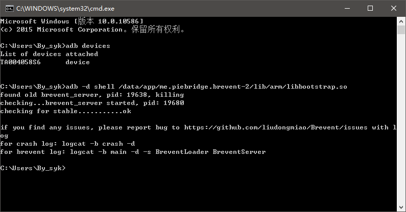
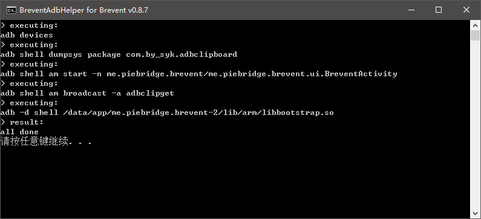

# BreventAdbHelper

这是针对##未ROOT##设备上使用「[黑域](http://www.coolapk.com/apk/me.piebridge.brevent)」`v0.8.7`的辅助工具——###一键启动黑域服务###。

### 假定

+ 已在电脑上配置`Java`、`adb`

+ 设备已启用##USB调试##

+ 设备已安装「[黑域](http://www.coolapk.com/apk/me.piebridge.brevent)」

+ 设备已安装「[ADB Clipboard GetSet](out/AdbClipboardGetSet.apk)」
  用于支持通过adb命令获取设备剪切板内容的APP

### 一般过程

1. 设备开机

2. 启动「黑域」
  

3. 连接电脑，对照敲入adb命令并执行
  

成功后「黑域」截图：

### 一键过程

一般过程中2、3步比较繁琐，因此有制作一键工具的必要。

1. 设备开机

2. 双击`BreventAdbHelper.bat`
  

搞定。

### License

    Copyright 2017 By_syk

    Licensed under the Apache License, Version 2.0 (the "License");
    you may not use this file except in compliance with the License.
    You may obtain a copy of the License at

       http://www.apache.org/licenses/LICENSE-2.0

    Unless required by applicable law or agreed to in writing, software
    distributed under the License is distributed on an "AS IS" BASIS,
    WITHOUT WARRANTIES OR CONDITIONS OF ANY KIND, either express or implied.
    See the License for the specific language governing permissions and
    limitations under the License.

*Copyright &#169; 2017 By_syk. All rights reserved.*

